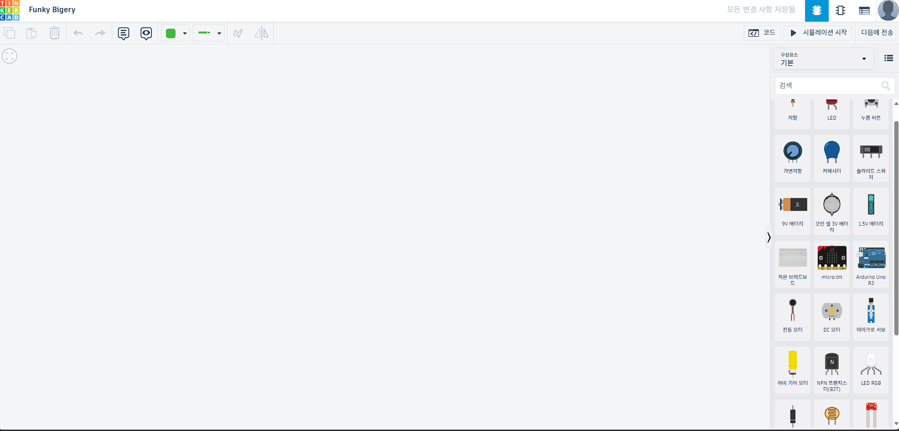
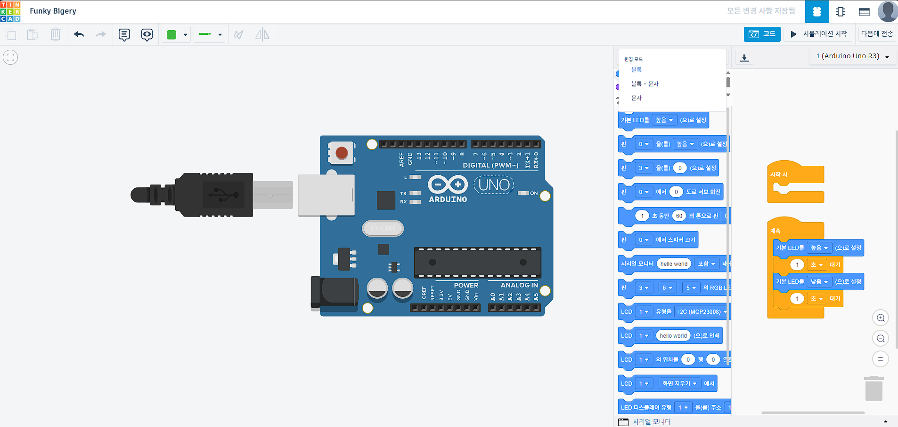
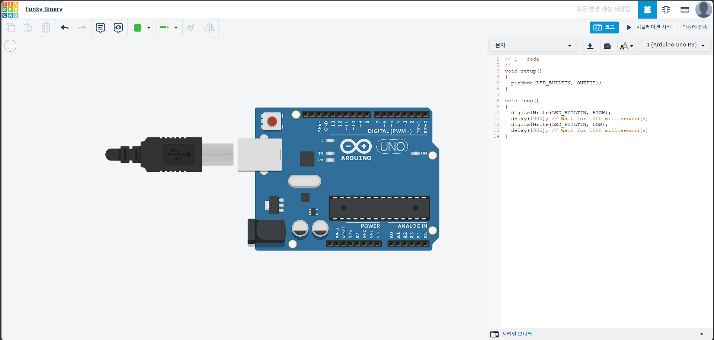

### 들어가며
이 글에서는 아두이노를 알아보고, 간단하게 사용해 볼 예정이에요.

### 아두이노란?

이런 보드를 말해요.

특징으로는 회로도와 소스 코드가 모두 오픈되어 있어서 누구나 이걸 사용해서 프로젝트를 할 수 있어요. \
누구나 할 수 있다는 점 덕분에, 관련된 자료 또한 인터넷에 아주 많아요. \
개발의 장벽을 확 낮춘, 획기적인 보드라고 할 수 있어요.

### 뭘 만들수 있는가?
깊게는 마이크로프로세서에 대해 알아야 하지만, 단순하게 나열하자면 이런 것들이 있어요.
- [CNC 및 3D 프린터 제어기](https://reprap.org/wiki/RAMPS_1.4/kr)
- [인공위성](https://en.wikipedia.org/wiki/ArduSat)
- 기타 등등...

### 사용해보기
실제로 아두이노를 사용해보는게 가장 좋지만, 이 글은 집에서 혼자 복습하는 상황에도 초점을 맞추고 있어요. \
따라서 실제 보드 대신, 시뮬레이션으로 아두이노를 사용해 볼게요. \
시뮬레이션을 할 수 있는 사이트로는 팅커캐드를 사용할 예정이에요. \
[팅커캐드](https://www.tinkercad.com/)에 접속하고, 로그인 해주세요.


오른쪽의 "만들기"를 누르고, 회로를 선택해 주세요.


이제 여기서부터 직접 회로를 만들고, 시뮬레이션해볼 수 있어요. \
우리는 아두이노를 사용하는 것이 목적이기 때문에, 오른쪽에서 아두이노를 가져올게요.


불러왔다면 우측의 코드 버튼을 누르고, 드롭다운 메뉴에서 "코드" 를 눌러줄게요.


그러면 이렇게 아두이노 코드가 표시돼요. \
기본으로 작성된 코드는 1초 간격으로 LED를 깜빡이는 코드에요. \
실제 아두이노의 예제 코드 중 Blink 예제와 같아요.

한번 실행해 볼까요? \
시뮬레이션이 실행되면 `L` 이라고 적힌 아두이노 보드 위의 LED가 깜빡이는 것을 확인할 수 있어요.

### 뜯어보기

기본으로 작성된 코드에 대해 좀 더 알아볼게요.
```C
// C++ code
//
void setup()
{
  pinMode(LED_BUILTIN, OUTPUT);
}

void loop()
{
  digitalWrite(LED_BUILTIN, HIGH);
  delay(1000); // Wait for 1000 millisecond(s)
  digitalWrite(LED_BUILTIN, LOW);
  delay(1000); // Wait for 1000 millisecond(s)
}
```

먼저 `setup()` 이라는 함수를 볼게요. \
`setup()` 함수는 보드가 켜지고, 딱 한번만 실행되는 함수에요. \
그래서 보통 세팅 등에 사용돼요.

`pinMode()` 라는 함수 하나를 사용한 것을 확인할 수 있어요. \
아두이노의 `pinMode()` 함수는 이런 의미를 가져요.
> 이 핀을 어떻게 사용하겠다!

실제로 코드를 보면, `LED_BUILTIN` 이라는 핀을 `OUTPUT` 으로 사용할 것 같다는 유추가 가능해요. \
여기서 `LED_BUILTIN`은 말 그대로 보드 위에 내장된 LED로 이어지는 핀을 말해요. \
`OUTPUT` 은 핀의 방향으로, 출력 핀으로 사용하겠다는 의미를 가져요.

따라서 `pinMode(LED_BUILTIN, OUTPUT);` 라는 함수는 이런 의미를 가지는 것을 알 수 있어요.
> 보드에 내장된 LED를 출력으로 사용할게요!

그리고 여러분은 실제로 내장된 LED를 출력으로 사용했어요. \
어떻게 사용했을까요? 이 내용은 `loop()` 함수에 있어요. \
`loop()` 함수는 계속해서 실행되는 함수에요. \
그래서 보통 실제로 실행되어야 하는 코드들이 들어가요.

보면, `digitalWrite()` 함수와 `delay()` 함수가 번갈아가며 두 번 사용되었어요. \
`digitalWrite()` 함수는 이런 의미를 가져요.
> 이 핀을 키거나 끄겠다!

디지털은 0과 1밖에 없기 때문에, 결국 끄거나 키는 것과 같아요. \
이때, 0은 끄겠다는 의미에요. 아두이노에서는 `LOW`와 같아요. \
1은 키겠다는 의미에요. 아두이노에서 `HIGH`로 불려요.

따라서 `loop()` 함수의 첫 줄을 다시 보면, 이런 의미인 것을 알 수 있어요.
> 내장된 LED를 키겠다!

또, 세 번째 줄은 이런 의미인 것을 알 수 있어요.
> 내장된 LED를 끄겠다!

이제 남은 `delay()` 를 알아볼게요. \
delay는 지연을 의미하는 영단어에요. \
아두이노에서도 말 그대로, 동작을 지연시켜요. \
바꿔 말하면 정해진 시간동안 기다리며 아무것도 하지 않아요. \
얼만큼 지연시킬지는 괄호 안의 값을 밀리초 (1000분의 1초) 단위로 입력 받아 정할 수 있어요. \
따라서 `delay(1000)` 이라는 함수는 이런 의미를 가져요.
> 1000 밀리초 (=1초) 동안 기다리겠다!

최종적으로 `digitalWrite()` 와 `delay()` 모두 이해했다면 `loop()` 내의 동작을 이렇게 이해할 수 있어요.
> LED를 키고, 1초 기다리고, LED를 끄고, 1초 기다리고, LED를 키고, ... (반복)

### 과제 2: 점멸 패턴 바꾸기
이제 실제로 코드를 짜 볼 시간이에요. \
지금은 LED가 1초에 한번씩 꺼졌다 켜지며 점멸을 반복하고 있지만, 이 패턴을 바꿔보세요. \
점멸 패턴은 어떻게 해도 괜찮아요.

### 마무리
이렇게 아두이노에 대해 알아보았고, 디지털 출력을 제어하는 방법에 대해 알아봤어요. \
아두이노를 사용함에 있어서 가장 기본적인 요소이니 꼭 기억해 주세요.