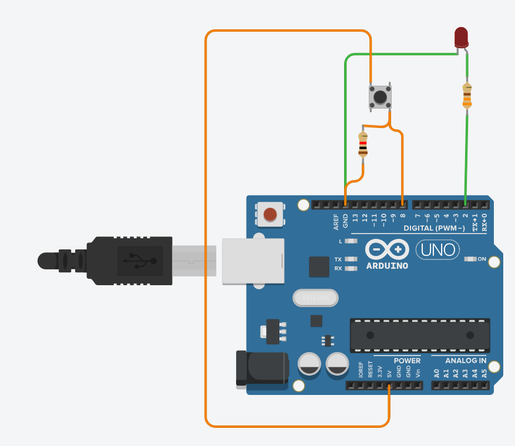

### 들어가며
이번 글에서는 아두이노를 사용해서 몇 가지 제어를 해볼게요. \
제어해볼 내용은 아래와 같아요.
1. 외부 LED 키고 끄기
2. 외부 버튼 입력 받기
3. 시리얼 모니터 사용하기

### 회로 구성
우선 지난번과 같이 [팅커캐드](https://www.tinkercad.com/)를 켜 주세요. \
그 다음 아래와 같은 회로를 구성할게요.

> LED 저항은 330 옴, 버튼 저항은 1k 옴 이에요.

### 외부 LED 키고 끄기
회로를 다 구성했다면, 가장 먼저 LED를 제어해볼게요. \
LED는 출력 소자이므로, 출력을 제어하는 코드를 작성해야 해요. \
팅커캐드의 기본 코드를 활용할 수 있어요.
```C
// C++ code
//
void setup()
{
  pinMode(LED_BUILTIN, OUTPUT);
}

void loop()
{
  digitalWrite(LED_BUILTIN, HIGH);
  delay(1000); // Wait for 1000 millisecond(s)
  digitalWrite(LED_BUILTIN, LOW);
  delay(1000); // Wait for 1000 millisecond(s)
}
```
여기서 `pinMode();`와 `digitalWrite();`가 선택한 LED_BUILTIN은 말 그대로 내부에 내장된 LED를 의미해요. \
따라서 LED_BUILTIN 대신, 지금 LED를 연결한 핀인 `2`를 적어주면 돼요.
```C
// C++ code
//
void setup()
{
  pinMode(2, OUTPUT);
}

void loop()
{
  digitalWrite(2, HIGH);
  delay(1000); // Wait for 1000 millisecond(s)
  digitalWrite(2, LOW);
  delay(1000); // Wait for 1000 millisecond(s)
}
```
따라서 이렇게 수정하고 한번 실행하면, LED가 1초 간격으로 점멸하는 것을 확인할 수 있어요.

### 외부 버튼 입력 받기
이번에는 버튼을 입력으로 받아볼게요. \
버튼은 LED와 다르게 출력 소자가 아니라 입력 소자에요. \
즉, 우리가 버튼을 켜는게 아니라 버튼이 눌렸는지를 읽어와야 해요.

지금 회로는 풀다운(Pull-down) 방식으로 구성되어 있어요. \
이 방식은 버튼을 누르지 않았을 때는 입력 핀이 `LOW`가 되고, \
버튼을 누르면 입력 핀이 `HIGH`가 돼요.

여기서는 버튼이 `8`번 핀에 연결되어 있다고 가정할게요. \
만약 회로에서 다른 핀에 연결했다면, 아래 코드의 숫자만 바꿔주면 돼요.

```C
// C++ code
//
void setup()
{
  pinMode(8, INPUT);
}

void loop()
{
  int buttonState = digitalRead(8);
}
```

이번에는 `pinMode(8, INPUT);` 라는 코드가 추가되었어요. \
이건 8번 핀을 입력으로 사용하겠다는 의미에요.

또, `digitalRead(8)` 라는 새로운 함수가 나왔어요. \
이 함수는 말 그대로 디지털 값을 읽어와요. \
읽은 결과는 `HIGH` 또는 `LOW` 중 하나에요.

따라서 `int buttonState = digitalRead(8);` 라는 코드는 이렇게 이해할 수 있어요.
> 8번 핀의 현재 상태를 읽어서 buttonState에 저장하겠다!

이 상태를 바로 확인하고 싶다면, 조건문을 이용하면 돼요.

```C
// C++ code
//
void setup()
{
  pinMode(8, INPUT);
}

void loop()
{
  int buttonState = digitalRead(8);

  if(buttonState == HIGH) {
    // 버튼이 눌린 상태
  }
}
```

즉, 풀다운 회로에서는 `HIGH` 면 버튼이 눌린 상태, \
`LOW` 면 버튼이 눌리지 않은 상태라고 생각하면 돼요.

### 시리얼 모니터 사용하기
입력을 읽기만 하고 끝내면, 실제로 잘 동작하는지 확인하기 어려워요. \
그래서 이번에는 시리얼 모니터를 사용해볼게요. \
시리얼 모니터는 아두이노가 텍스트를 출력할 수 있는 창이라고 생각하면 돼요.

우선 아래 코드를 작성해 주세요.

```C
// C++ code
//
void setup()
{
  pinMode(8, INPUT);
  Serial.begin(9600);
}

void loop()
{
  int buttonState = digitalRead(8);

  if(buttonState == HIGH) {
    Serial.println("Button Pressed!");
  }
}
```

여기서 `Serial.begin(9600);` 는 시리얼 통신을 시작하겠다는 의미에요. \
`9600` 이라는 숫자는 통신 속도인데, 지금은 일단 이렇게 적는구나 정도로 이해해도 괜찮아요.

또, `Serial.println()` 은 괄호 안의 내용을 시리얼 모니터에 한 줄 출력해요. \
그래서 버튼을 누르면 `"Button Pressed!"` 라는 문장이 계속 출력될 거에요.

한번 실행한 뒤, 아래쪽의 시리얼 모니터 창을 열어 확인해 보세요. \
버튼을 누르고 있는 동안은 같은 문장이 여러 번 출력될 수 있어요. \
왜냐하면 `loop()` 함수가 매우 빠르게 반복되기 때문이에요.

### 과제 3: 버튼으로 LED 제어하기
이제 직접 코드를 짜볼 시간이에요. \
버튼을 눌렀을 때 LED가 켜지고, 버튼을 떼면 LED가 꺼지도록 만들어보세요.

가장 단순하게는, 버튼의 상태를 읽어서 그대로 LED 출력에 반영하면 돼요. \
예를 들어 버튼이 `HIGH` 면 LED를 켜고, `LOW` 면 LED를 끄는 방식이에요.

그런데 실제 버튼은 누를 때 신호가 한 번에 깔끔하게 바뀌지 않을 수 있어요. \
이 현상을 `바운싱(Bouncing)` 이라고 해요. \
그래서 LED가 예상과 다르게 빠르게 깜빡이거나, 여러 번 눌린 것처럼 보일 수도 있어요.

힌트:
- ChatGPT 같은 AI를 사용해서 `디바운싱(Debouncing)` 이라는 키워드로 찾아보세요.
- 조금 더 욕심이 난다면 `히스테리시스(Hysteresis)` 라는 개념도 찾아봐도 좋아요.
- 중요한 건 코드를 그대로 복사하는게 아니라, 왜 그렇게 동작하는지 이해하는 거에요.

직접 구현해보고, 잘 안 되면 버튼 상태와 LED 상태를 시리얼 모니터에 같이 출력해보세요. \
그러면 어디서 문제가 생기는지 훨씬 찾기 쉬워질 거에요.
