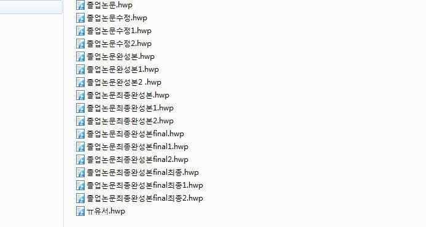

### 들어가며
누리나래는 특정 한 분야만 하는 동아리가 아니에요. \
회로, 소프트웨어, 하드웨어를 모두 연결해서 \
실제로 동작하는 시스템을 만드는 곳이에요.

그래서 여기서는 무엇을 얼마나 아느냐보다,
> 함께 만들고, 끝까지 동작시키는 것이 중요하다.

이 기준에서 만들어진 게 누리나래의 개발 문화예요.

### 1. 결과를 공유하기 -- GitHub

#### 일반적인 개발 흐름의 문제
처음에는 이렇게 작업하기 쉬워요.
- 파일을 저장하고, 완성되면 파일을 메신저로 공유하기
- 완성이 안 되었다면 내 PC에 놔두기
- 파일 이름 뒤에 v1, v2 붙이면서 작업하기

이렇게 작업하면 어느 순간 이런 상황이 발생해요.

> *버전 관리가 필요한 이유...*

위의 상황에서, 우리는 이러한 문제들을 짚을 수 있어요.
- 파일 사이에 어떠한 변경이 있는지 알 수 없어요.
- 가장 최신 버전이 어떤 것인지 명확하게 알 수 없어요.

이런 문제들을 해결하기 위해서 필요한 것이 바로 버전 관리에요. \
버전 관리는 VCS(Version Control System), 즉 버전 관리 시스템을 통해서 할 수 있어요. \
많은 VCS들이 이미 존재하지만, 가장 많이 사용되는 버전 관리 시스템은 `Git` 이에요. \
Git에 대해서 더 많이 알아보고 싶다면 관련된 [Microsoft 문서](https://learn.microsoft.com/ko-kr/devops/develop/git/what-is-git)를 참조해 보세요. \
우리는 2주차에서 본격적으로 학습해볼 예정이니, 지금은 이런 것이 있다는 정도만 알아두면 돼요.

#### 아직 남아있는 문제
이렇게 관리된 버전을 어디다가 올리고, 어디서 공유해야 할까요? \
카카오톡이나 디스코드 등으로 공유하게 되면 이런 문제가 발생해요.
- 사람마다 최신 버전이 다르게 돼요.
- 작업을 끝낼 때마다 다시 메신저로 공유를 해야해요.
- 내가 작업하던 중, 다른 사람이 변경을 했다면 일일이 변경 사항을 합쳐야 해요.

기껏 버전 관리를 했는데, 이런 문제가 발생한다면 속상하겠죠? \
이런 문제를 한번에 해결해주는 것이 바로 [GitHub](https://github.com) 에요. \
GitHub를 사용하면 작업물을 중앙에서 처리하고 공유할 수 있게 돼요. \
마찬가지로 2주차에 본격적으로 학습해볼 예정이니, **Git과 GitHub가 존재한다**는 것만 기억해 주세요.

### 2. 자유롭게 일하되, 약속은 지킵니다

누리나래는 누가 “이거 해라”라고 시키는 구조가 아니에요. \
각자가 하고 싶은 걸 선택하고, 스스로 만들어가는 방식이에요.

그래서 기본적으로는 굉장히 자유로워요.

- 언제 작업해도 되고
- 어떤 방식으로 접근해도 되고
- 새로운 시도도 얼마든지 가능해요.

그런데 여기서 하나만 꼭 지켜야 해요.

#### 필요할 때는 반드시 그 자리에 있어주기
- 회의하기로 한 시간
- 그동안 구현한 것을 시연해 보기로 한 날
- 팀원이 기다리고 있는 순간

이때 출석하지 않는다면, 이건 단순한 개인 문제가 아니라 팀 전체를 멈추게 하는 일이에요. \
자유는 최대한 보장하지만, 약속은 반드시 지켜야 해요.

이건 실력보다 훨씬 중요한 기준이에요.

### 3. AI는 마음껏 써도 됩니다 -- 대신 이해하세요
요즘은 AI로 거의 모든 걸 만들 수 있어요. \
특히나 혼자서 무언가를 배울 때, 거의 모든 것을 대신 해줄 수 있죠.

AI가 너무나도 유능하니, 우리는 이렇게 정했어요.
#### AI 사용을 적극 권장합니다. 두번 권장합니다.
- AI로 코드를 만들어도 되고
- 모르는 부분을 AI한테 물어보면서 진행해도 되고
- 심지어 전부 AI로 구현해도 괜찮아요

그런데 딱 하나는 반드시 지켜야 해요.
#### 지금 무엇을 만들고, 어떤걸 하고 있는지는 설명할 수 있어야 한다.
왜냐하면,
- 문제가 생겼을 때 고칠 수 있어야 하고
- 팀원과 이야기할 수 있어야 하고
- 결국 **내가 만든 것**이 되어야 해요

이걸 지키지 못한다면 겉으로는 돌아가지만, 아무것도 통제할 수 없게 돼요. \
결국 내가 만든 것이 되려면, 내가 이해한 채로 돌아가야 하니까요.

그래서 기준은 단순해요.
- AI는 도구일 뿐, 당신의 생각을 대신해줄 수 없어요.
- 내가 만든 것이라면 모두 설명할 수 있어야 해요.

이 이상으로 AI를 사용하는 것은 권장하지 않아요.

### 마치며
처음부터 잘하는 사람은 없어요. \
그러니 처음에는 잘 못해도 괜찮아요.

대신 이건 꼭 기억했으면 좋겠어요.
- 작업물은 꼭 공유하기
- 자유롭게 하되, 약속은 지키기
- AI를 쓰되, 이해하기

이 세 가지만 지켜도 충분히 성장할 수 있어요.