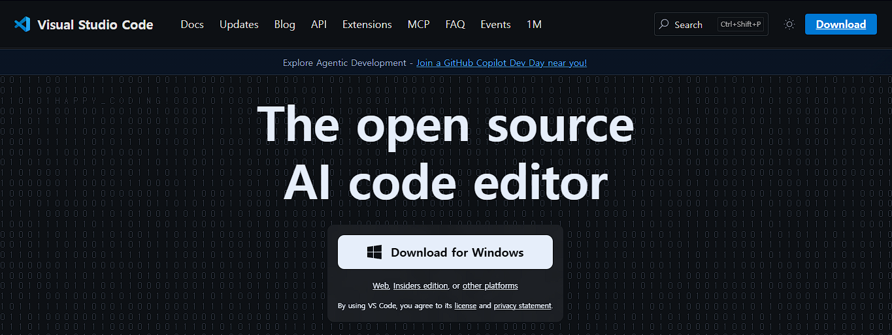
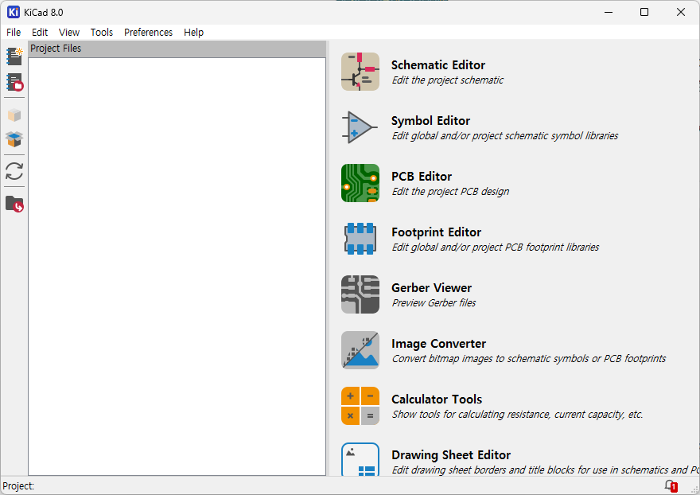

### 들어가며
앞으로 동아리 활동에 필요한 소프트웨에 대해 알아보고, 설치해볼 예정이에요. \
PC에 약 15 GB 정도의 여유 공간이 필요하니, 확보해두는 것을 추천해요. \
혹시 설치가 어려운 사람은 1주차 교육에서 다룰 예정이니, 그때 진행해도 괜찮아요.

### 소프트웨어 개발
#### Visual Studio Code 설치하기
소프트웨어를 개발하려면, 다시 말해 코드를 작성하려면, 코드를 편집할 수 있는 프로그램이 필요해요. \
우리는 코드 작성에 [Visual Studio Code (VSCode)](https://code.visualstudio.com/)를 사용할게요. \
가장 범용적으로 적절한 툴이기도 하고, 각종 예제가 많아서 배우기 편리해요. \
이 [링크](https://code.visualstudio.com/)에 접속하면, 아래와 같이 여러분의 운영 체제에 맞는 다운로드 옵션이 뜰거에요. \

여기서 프로그램을 다운받고, 설치를 진행하면 돼요.

#### Git 설치하기
앞서 말했듯이, 버전 관리를 위해서 Git을 설치해야 해요. \
Git 설치는 교육일에 함께 진행할게요.

### 회로 설계 -- KiCad
회로 설계는 크게 두 단계로 나뉘어요.
1. 회로도 그리기
2. 회로 기판 (PCB)을 디자인하기

예전에는 두 툴이 분리되어 있어 따로 설치해야 하는 경우가 많았지만, 우리는 통합된 툴인 [KiCad](https://www.kicad.org/)를 사용해요. \
세부적인 내용은 2주차부터 익힐 예정이고, 지금은 설치만 진행하면 돼요.

사용중인 OS에 따라 아래 링크를 클릭하면 돼요.
- Windows 64-Bit: [링크](https://github.com/KiCad/kicad-source-mirror/releases/download/10.0.0/kicad-10.0.0-x86_64.exe)
  - 대부분 이 경우에 해당할 거에요.
- Windows arm64: [링크](https://github.com/KiCad/kicad-source-mirror/releases/download/10.0.0/kicad-10.0.0-arm64.exe)
- MacOS: [링크](https://github.com/KiCad/kicad-source-mirror/releases/download/10.0.0/kicad-unified-universal-10.0.0.dmg)
- Linux: [링크](https://mirrors.mit.edu/kicad/appimage/stable/kicad-10.0.0-1-x86_64.AppImage)

설치가 완료되고 KiCad를 실행하면 아래와 같이 나와야 해요.

> 위에 표시된 버전으로 10.0.0 이 표시되어야 해요.

### 기구 설계 -- Fusion360
설계 프로그램은 종류가 많지만, 우리는 학생에게 무료 라이센스를 제공하는 Fusion 360을 사용할 거에요. \
[Fusion 360 교육 엑세스](https://www.autodesk.com/kr/education/edu-software/overview?sorting=featured&filters=individual#FSN)를 통해 학생 인증이 가능하고, 인증이 가능하신 분은 설치까지 진행해 주세요. \
설치가 어려우신 분들은 교육일에 함께 진행할게요.