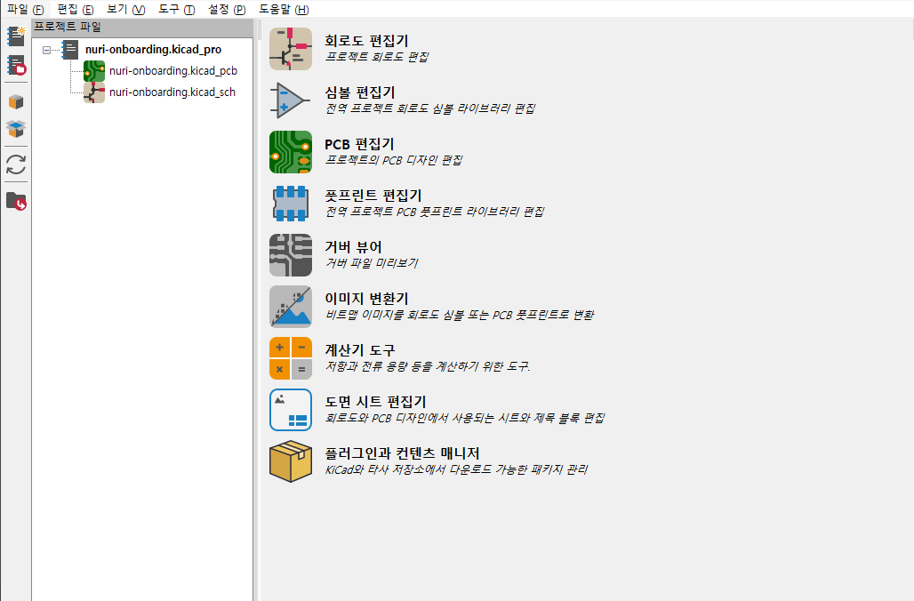
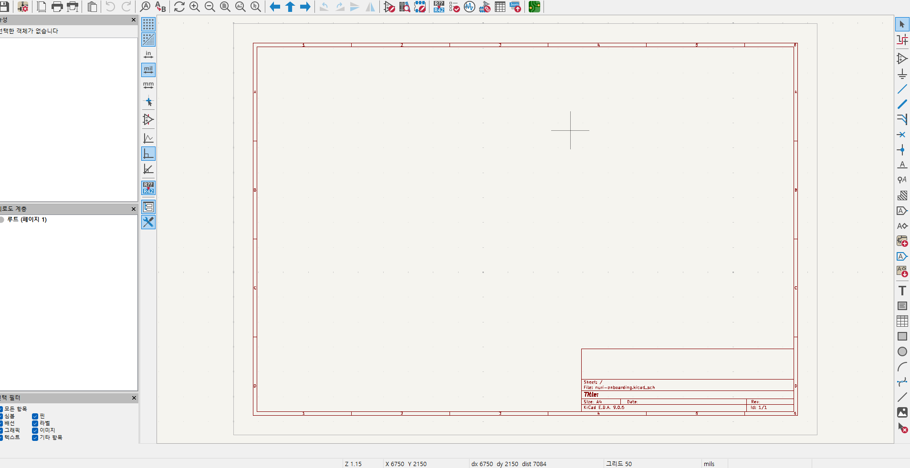
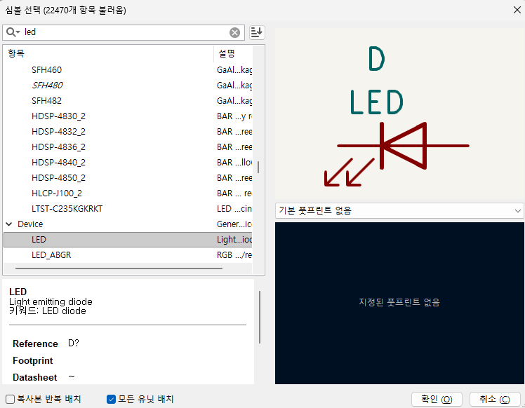
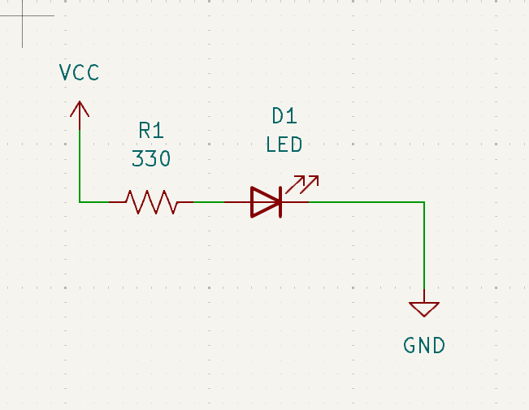

### 들어가며
이번 글에서는 KiCad에 대해 알아보고, 간단한 회로도를 작성해 볼게요.

### KiCad란?
전자 회로를 그리는 캐드 프로그램 중, 무료로 사용 가능한 프로그램이에요. \
비슷한 프로그램으로는 OrCAD, Altium 등이 있어요. \
하지만 전문가를 대상으로 한 유료 소프트웨어이다 보니, 학습에 시간이 걸리는 관계로 우선 KiCad를 사용해서 배울게요.

### 프로젝트 만들어보기
KiCad를 실행하고, 새로운 프로젝트를 만들어 주세요. \
이름은 `nuri-onboarding`으로 할게요. \
정상적으로 만들었다면, 아래와 같은 화면을 볼 수 있어요.

여기서 왼쪽 `프로젝트 파일`은 프로젝트의 구조를 나타내요. \
지금은 `.kicad_pcb`로 끝나는 파일 하나, `.kicad_sch`로 끝나는 파일 하나가 있어요. \
이 둘은 각각 기판에 대한 정보와, 회로도에 대한 정보를 담고 있어요. \
지금은 이런게 있다 정도만 알고 넘어가도 괜찮아요.

### 첫 회로 구성해보기
우측의 회로도 편집기를 눌러줄게요.

이런 화면이 보일 거에요. \
툴의 자세한 사용법은 사용해보며 알아가기로 하고, 지금은 LED 하나를 배치해 볼게요. \
우측의 심볼 배치 메뉴를 누르고, LED를 검색해서 배치해 주세요. (처음이면 렉이 걸릴 수 있어요) \

여기서 `확인`을 눌러주면 배치가 될 거에요.

이번엔 선을 그려볼게요. \
우측의 선 그리기 메뉴를 누르거나 LED의 끝을 누르면 선을 그릴 수 있어요. \
더블클릭을 하면 선 그리기를 끝낼 수 있어요.

### 과제 4: LED 회로 꾸미기
우측의 심볼 배치 메뉴와, 전원 심볼 배치, 선 그리기 메뉴를 사용해서 아래와 같은 LED 회로를 그려봐요. \

> 저항은 R_US로 찾을 수 있어요!