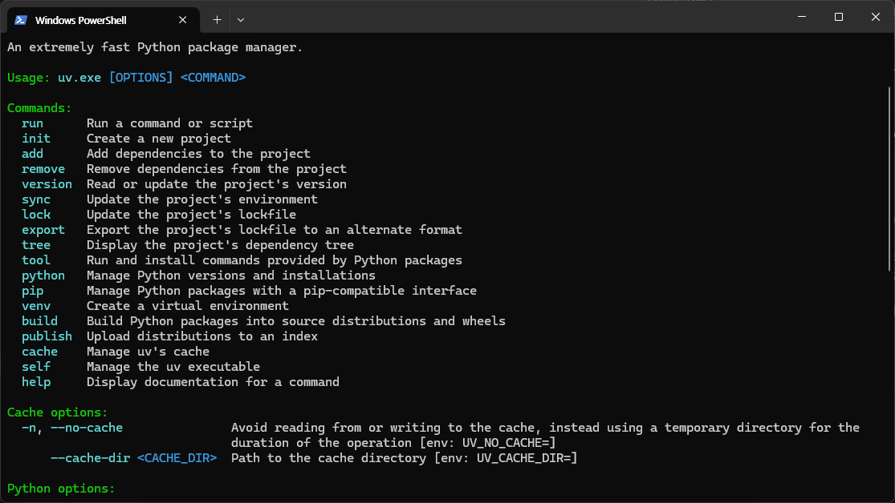

### 들어가며
Python (파이썬) 이 무엇인지, 어떻게 실행할 수 있는지 간략하게 알아봐요.

### Python이란?
[귀도 반 로섬](https://en.wikipedia.org/wiki/Guido_van_Rossum) 이라는 프로그래머에 의해 개발되었어요. \
이전부터 많이 사용된 C, C++, Javascript 대비 이러한 강점을 가지고 있어 최근 가장 많이 사용되고 있어요.

### 강점 1: 배우기 쉬워요
예를 들어, C에서 콘솔 창에 `Hello World!` 라는 글을 띄우기 위해서는 이런 프로그램을 작성해야 해요.
```C
#include <stdio.h>

int main(void) 
{
    printf("Hello World!\n");

    return 0;
}
```

하지만 Python에서는 단 한줄의 프로그램으로 같은 동작을 할 수 있어요.
```Python
print("Hello World!")
```

물론 C의 코드가 길어진 것은 라이브러리를 불러오고, `main` 함수를 작성했기 때문이에요. \
그러나 Python에서는 이러한 과정을 몰라도 돼서 배우기 쉬워요. \
코드가 읽기 쉬운건 덤이에요.

### 강점 2: 다양하게 사용될 수 있어요
굉장히 많은 기능들을 구현할 수 있어요. 예를 들면...
- AI
  - AI 업계에서 사실상 표준으로 사용돼요.
- 웹 서버
  - 인스타그램의 서버는 Python으로 동작해요.
- 업무 자동화
  - 양식에 맞춘 PDF 자동 생성 등이 가능해요.

이 외에도 GUI 개발, 데이터 분석 등 대부분의 기능을 구현할 수 있어요. \
이러한 범용성으로 인해서 Python이 많이 사용되고 있어요.

### Python 설치하기
이제 Python에 대해 간략하게 알아봤으니, 설치해볼 차례에요. \
Python을 설치하는 방법은 정말 다양하지만, 우리는 최근 가장 많이 사용되는 [uv](https://docs.astral.sh/uv/) 라는 패키지 관리 도구를 사용할게요. \
uv를 설치하는 방법은 간단해요. \
먼저 Windows의 경우 Powershell, macOS의 경우 Terminal을 실행해 주세요.
> Windows 모양 키를 누른 후, Powershell을 검색하면 돼요!
> macOS라면 Command+Space를 누른 후, terminal을 검색하면 돼요!

이후 아래와 같이 입력해 주세요. \
**Windows**
```Powershell
powershell -ExecutionPolicy ByPass -c "irm https://astral.sh/uv/install.ps1 | iex"
```

**macOS**
```zsh
curl -LsSf https://astral.sh/uv/install.sh | sh
```

입력 후에는 `enter`키를 눌러줄게요. \
이것저것 설치 과정이 완료되어서 Done! 과 같은 문구가 뜬다면 Python을 실행할 준비가 완료되었어요.

제대로 설치되었는지 확인하기 위해, `uv`를 입력하고 `enter` 키를 눌러줄게요.

이렇게 표시된다면 제대로 설치되었어요. \
혹시 따라오기 어려운 분들은 구글 등에 설치 방법을 검색해서 진행해 주세요.

### 마치며
이 글에서는 Python에 대해 간략하게 알아보고, Python을 실행하기 위한 패키지 관리 도구인 `uv`를 설치했어요. \
다음 글에서는 Python의 문법에 대해 간략하게 알아볼게요.