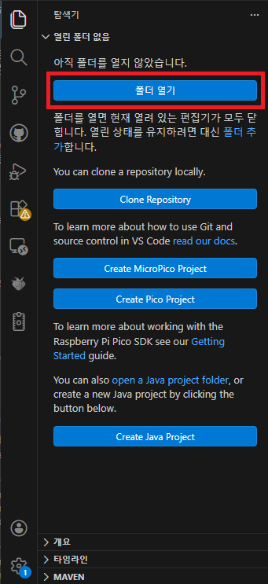
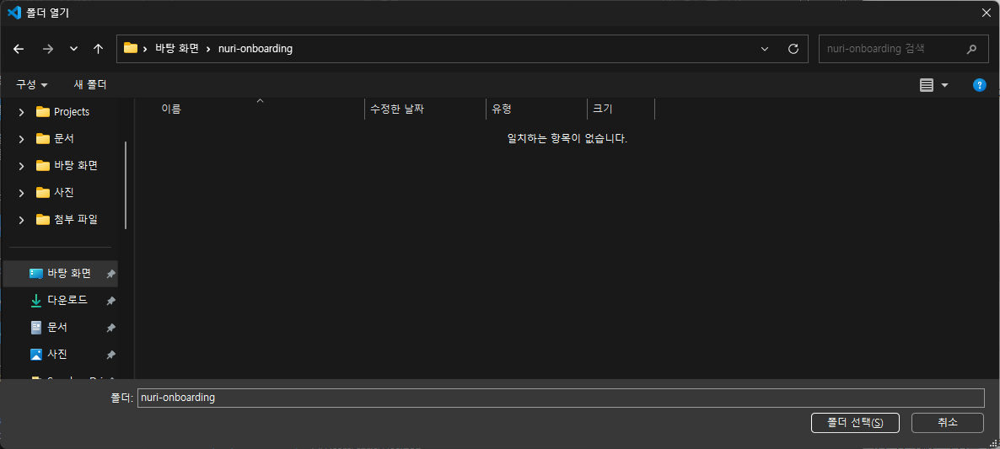
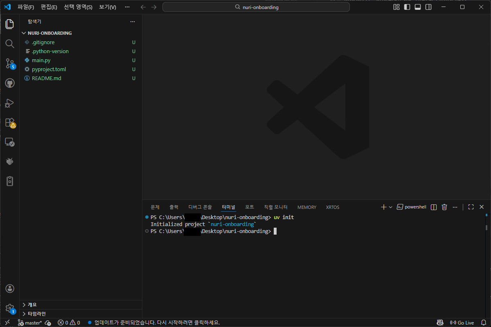
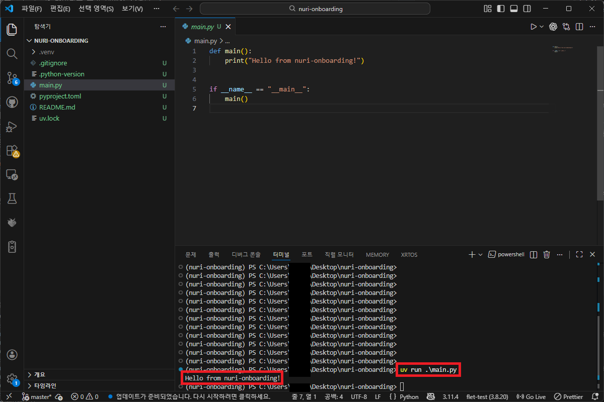

### 들어가며
2주차 부터는 본격적으로 개발 관련 지식을 학습할 예정이에요. \
그 중 이번 글에서는 Python을 사용하는 방법에 대해 알아볼게요.

### Python이란?
Python은 프로그래밍 언어 중 하나로, 귀도 반 로섬이라는 프로그래머가 개발한 언어에요. \
배우기 쉽고, 무엇보다 AI와 같은 분야에서 많이 사용되며 최근 가장 많이 사용되고 있어요. \
동아리 활동에서도 많이 사용되는 언어이다 보니 Python을 학습해보기로 해요.

### 설치하기
파이썬을 설치하고 사용하는 방법은 정말 다양해요. \
우리는 최근 가장 많이 사용되는 `UV`라는 프로그램을 사용해 설치해 볼게요. \
우선 VSCode를 실행하고, 왼쪽의 파일 모양 아이콘을 눌러줄게요.

> 이런 창이 보이면, 폴더 열기를 눌러주면 돼요!
> 앞으로의 교육에서 쭉 사용할 폴더이니, 지우지 말아주세요.

이후 바탕화면에 `nuri-onboarding` 이라는 이름의 폴더를 만들고, \
오른쪽 아래의 `폴더 선택`을 눌러주세요.

폴더가 열렸다면 상단 메뉴에서 터미널을 누르고, 새 터미널을 눌러 실행해 주세요. \
단축키로는 ``Ctrl+Shift+` ``에요. \
여기서 윈도우를 쓰고 있다면,
```powershell
powershell -ExecutionPolicy ByPass -c "irm https://astral.sh/uv/install.ps1 | iex"
``` 
맥북을 쓰고 있다면,
```zsh
curl -LsSf https://astral.sh/uv/install.sh | sh
```
를 입력하고 `enter`키를 눌러줄게요. \
이것저것 설치 과정이 완료되어서 Done! 과 같은 문구가 뜬다면, 이제 프로젝트를 생성해 줄게요. \
`uv init` 이라고 적고, `enter`키를 눌러줄게요. \
모두 정상적으로 진행되었다면, 이렇게 보여야 해요.

여기까지 왔다면, Python을 사용할 준비가 완료 되었어요. \
잘못된 부분이 있다면 우선 구글링 또는 AI를 사용해 문제를 해결해봐요. \
기본적인 실행을 확인하려면, `uv run main.py` 를 입력해서 `main.py` 라는 파일을 실행할 수 있어요.

> 축하해요! 처음으로 파이썬을 실행해 봤어요.
### 간단한 문법 소개
Python은 C와 비슷한 부분도 있지만, 훨씬 간단하게 쓸 수 있는 언어에요. \
분량 상, 최대한 간결하게 알아볼 예정이에요. \
간단한 계산부터 알아볼게요.
#### 사칙연산
기본적인 계산은 C와 거의 동일해요.
```Python
print(1 + 2)    # 3
print(5 - 3)    # 2
print(4 * 2)    # 8
print(10 / 2)   # 5
```
C랑 다른 점은, `printf()` 같은 걸 안 쓰고 그냥 `print()` 하나로 출력한다는 점이에요.
#### 입/출력
출력은 방금 본 것처럼 `print()`를 사용해요.

```python
print("Hello World")
```

입력은 `input()`을 사용해요.

```python
name = input("이름을 입력하세요: ")
print(name)
```
C에서는 `scanf` 같은 걸 써야 했는데, Python은 그냥 `input()` 하나면 끝이에요.

#### 변수 선언
C에서는 변수 타입을 반드시 지정해야 했죠. \
예를 들어 `a` 라는 이름을 가지는 정수형 변수에 10 이라는 값을 넣으려면,

```c
int a = 10;
```
와 같이 적어야 했어요. \
그러나 Python은 타입을 신경 쓸 필요가 없어요.

```python
a = 10
b = 3.14
name = "홍길동"
```

이렇게 적으면 자동으로 타입이 결정됩니다. \
이게 Python이 쉬운 이유 중 하나에요.

#### 반복문
반복문이라는 말 뜻을 그대로 풀이하면, 반복하는 명령어에요. \
C에서는 보통 이렇게 쓸 수 있어요:

```c
for(int i = 0; i < 5; i++) {
    printf("%d\n", i);
}
```
이 프로그램의 실행 결과는 0부터 4까지의 값이 나와요. \
Python은 조금 다르게 생겼어요.

```python
for i in range(5):
    print(i)
```

중요한 포인트는 두 가지에요:

* `{}` 대신 **들여쓰기(Indent)** 로 실행 구조를 구분해요.
* `range(5)`는 0부터 4까지라는 의미를 가져요.

즉, 이 프로그램의 실행 구조는 아래와 같아요.
1. range(5)를 사용하여 i 값은 0부터 4까지 반복
2. print(i)는 i 값을 출력
3. 따라서 0부터 4까지의 값을 출력

지금은 이런 구문이 있다는 것만 알아도 괜찮아요.

#### 조건문
C에서는 조건문을 보통 이렇게 써요:

```c
int a = 10;
if(a > 0) {
    printf("양수\n");
}
```
a가 0보다 크면 `양수` 를 출력하게 하는 조건문이에요. \
이걸 Python에서는 이렇게 쓸 수 있어요.

Python:

```python
a = 10

if a > 0:
    print("양수")
```

여기서도 `{}` 대신 들여쓰기를 사용해요. \
들여쓰기를 지키는 것은 파이썬의 핵심적 요소이니, 꼭 기억해 주세요.

### 첫 코드 작성해보기
가장 기본적인 프로그램이에요.

```python
print("Hello World!")
```

이걸 실행하면, 터미널에 그대로 출력됩니다.

여기서 중요한 건 딱 하나입니다.

코드를 작성하고 → 실행하면 → 결과가 나온다

이 흐름을 익히는 게 가장 중요해요.

### 또 다른 코드 작성해보기
- 내 나이 입력 받아서 자기소개 하는 프로그램

### 다른 코드 작성해보기
- 1부터 100까지 증가하며 숫자를 출력하던 중 72번째에만 '칠십이'와 같이 한글로 출력하는 프로그램

### 과제 1: 프로그램 만들어보기
- 자유 주제로 코드 작성하기
- GPT 자유롭게 사용해도 됨
- 못 고르는 이들을 위한 예시 주제
  - 사칙연산 계산기
  - 몇개 더 추가해줘...

### 마무리
- 기본적인 개념을 잡는게 가장 어려움 -> 다른 사이트 같은데서 추가로 공부해보면서 하는거 권장
- 지금은 잘 몰라도 되는데, 잘 잡아놓으면 나중에 따라오기 벅차지 않음